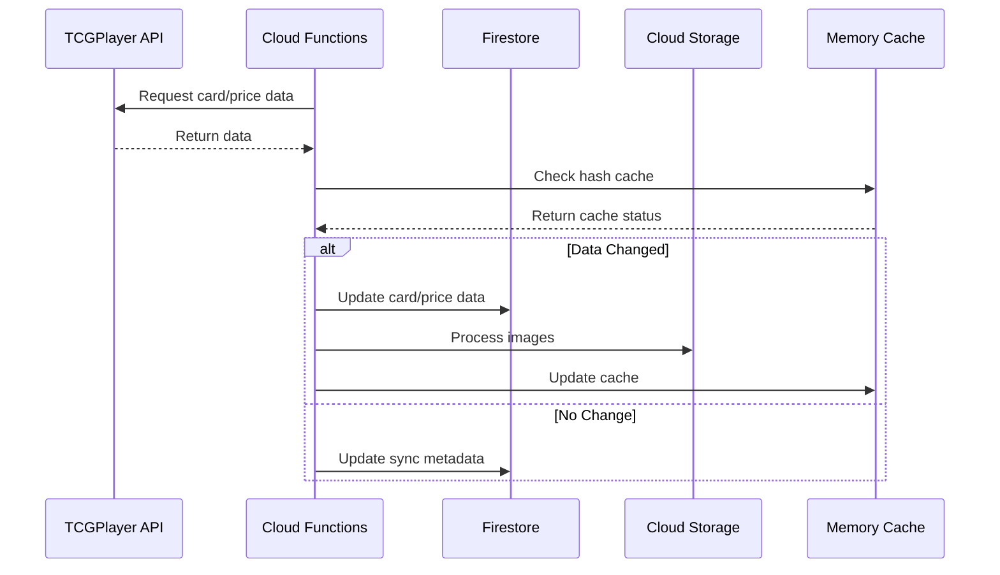
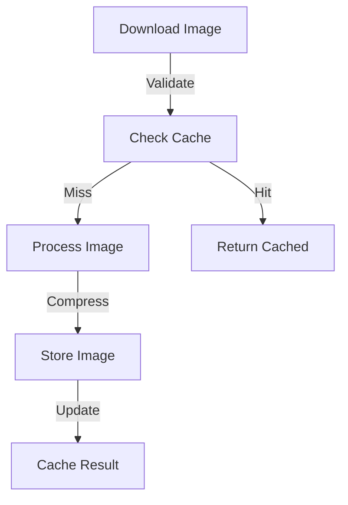

# System Architecture

## Overview

FFTCG Sync Service is a Firebase-based application designed to synchronize Final
Fantasy Trading Card Game data. The system uses Firebase Cloud Functions for
serverless operations, Firestore for data storage, and Firebase Storage for
image management.

## System Diagram

The diagram below illustrates the key components and their interactions.
Each color represents a different component type:

<ArchitectureDiagram :zoom="1.2" :showLabels="true" />

::: tip Component Types

- Blue: Firebase Services (Functions, Firestore, Auth)
- Green: Storage Systems (Cloud Storage, Cache)
- Orange: Core Functions (Card Sync, Price Sync, Image Processing)
- Gray: External Services (TCGPlayer API)
:::

## Core Components

### Firebase Services

#### Cloud Functions

```typescript
// Runtime Configuration
export const runtimeOpts = {
  timeoutSeconds: 540,
  memory: "1GiB",
} as const;

// Scheduled Functions
export const scheduledCardSync = onSchedule({
  schedule: "0 21 * * *",  // Daily at 21:00 UTC
  timeZone: "UTC",
  memory: runtimeOpts.memory,
  timeoutSeconds: runtimeOpts.timeoutSeconds,
  retryCount: 3,
});

export const scheduledPriceSync = onSchedule({
  schedule: "30 21 * * *", // Daily at 21:30 UTC
  timeZone: "UTC",
  memory: runtimeOpts.memory,
  timeoutSeconds: runtimeOpts.timeoutSeconds,
  retryCount: 3,
});
```

#### Firestore Collections

```typescript
export const COLLECTION = {
  CARDS: "cards",           // Card information
  PRICES: "prices",         // Price data
  SYNC_METADATA: "syncMetadata",  // Sync operation logs
  LOGS: "logs",            // System logs
  CARD_HASHES: "cardHashes",  // Card data version control
  PRICE_HASHES: "priceHashes",  // Price data version control
  IMAGE_METADATA: "imageMetadata",  // Image processing metadata
};
```

#### Storage Configuration

```typescript
export const STORAGE = {
  BUCKETS: {
    CARD_IMAGES: "fftcg-sync-service.firebasestorage.app",
  },
  PATHS: {
    IMAGES: "card-images",
  },
};
```

### Core Services

#### Card Synchronization

- Daily automated sync (21:00 UTC)
- Image processing and optimization
- Hash-based change detection
- Batch processing with configurable limits

#### Price Synchronization

- Daily automated sync (21:30 UTC)
- Price history tracking
- Market price monitoring
- Batch updates with validation

#### Image Processing

- Dual resolution support (200w/400w)
- Progressive JPEG compression
- Metadata tracking
- Cache integration

### Utility Systems

#### Caching System

```typescript
// Multiple cache layers
const cacheOptions = {
  cardCache: {
    max: 500,
    ttl: 1000 * 60 * 60  // 1 hour
  },
  imageCache: {
    metadata: {
      max: 1000,
      ttl: 1000 * 60 * 60  // 1 hour
    },
    buffer: {
      max: 100,
      ttl: 1000 * 60 * 5,  // 5 minutes
      maxSize: 50 * 1024 * 1024  // 50MB
    }
  }
};
```

#### Batch Processing

```typescript
interface BatchOptions {
  batchSize?: number;  // Default: 500
  delayBetweenBatches?: number;  // Default: 100ms
  onBatchComplete?: (stats: BatchProcessingStats) => Promise<void>;
}
```

#### Error Handling

```typescript
interface ErrorReport {
  timestamp: Date;
  context: string;
  error: string;
  stackTrace?: string;
  metadata?: Record<string, unknown>;
  severity: "ERROR" | "WARNING" | "CRITICAL";
}
```

## Data Flow

### Synchronization Process



### Image Processing Pipeline



## Performance Optimization

### Resource Management

- Memory allocation: 1GB per function
- Function timeout: 540 seconds
- Batch size: 500 items
- Cache TTL: Configurable per type

### Rate Limiting

```typescript
const rateLimits = {
  tcgPlayer: {
    requestsPerMinute: 100,
    concurrentRequests: 10
  },
  storage: {
    uploadsPerMinute: 50,
    maxConcurrent: 5
  }
};
```

## Security

### Authentication

- Firebase Authentication
- Service account credentials
- Token-based API access

### Data Protection

```typescript
// Storage Rules
service firebase.storage {
  match /b/{bucket}/o {
    match /card-images/{groupId}/{imageId} {
      allow read: if true;
      allow write: if request.auth != null 
        && request.auth.token.admin == true;
    }
  }
}
```

## Monitoring

### Health Checks

```typescript
export const healthCheck = onRequest({
  timeoutSeconds: 10,
  memory: "128MiB",
}, async (_req: Request, res: Response) => {
  res.json({
    status: "healthy",
    timestamp: new Date().toISOString(),
    version: "1.0.0",
  });
});
```

### Logging System

- Structured logging
- Error tracking
- Performance monitoring
- Operation auditing

## Scalability

### Function Configuration

- Automatic scaling
- Memory optimization
- Concurrent execution limits
- Regional deployment

### Resource Limits

- Storage quota management
- Database operation limits
- Function execution timeouts
- Cache size restrictions

## Development Setup

### Requirements

- Node.js 18 or higher
- Firebase CLI
- Firebase project with enabled services:
  - Cloud Functions
  - Firestore
  - Cloud Storage
  - Authentication

### Local Development

```bash
# Install dependencies
npm install

# Run locally
npm run serve

# Deploy
npm run deploy
```

## Additional Resources

- [Installation Guide](/setup/installation)
- [Configuration Guide](/setup/configuration)
- [API Documentation](/api/)
- [Troubleshooting Guide](/troubleshooting)
