# System Architecture

## Overview

FFTCG Sync Service is built on Firebase Cloud Functions with a microservices architecture, designed to synchronize card data, prices, and images from TCGplayer while maintaining high performance and reliability.

## System Diagram

The diagram below shows the key components and their interactions:

<ArchitectureDiagram :zoom="1" :showLabels="true" />

## Core Components

### Cloud Functions

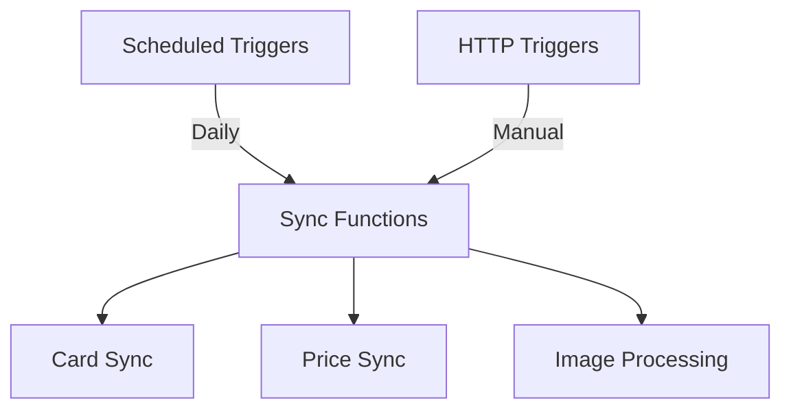

#### Functions Structure

- `scheduledCardSync` - Daily card data synchronization
- `scheduledPriceSync` - Daily price updates
- `testCardSync` - Test endpoint for card sync
- `testPriceSync` - Test endpoint for price sync
- `manualCardSync` - Manual trigger for full sync
- `manualPriceSync` - Manual trigger for price sync
- `healthCheck` - System health monitoring

### Storage Systems

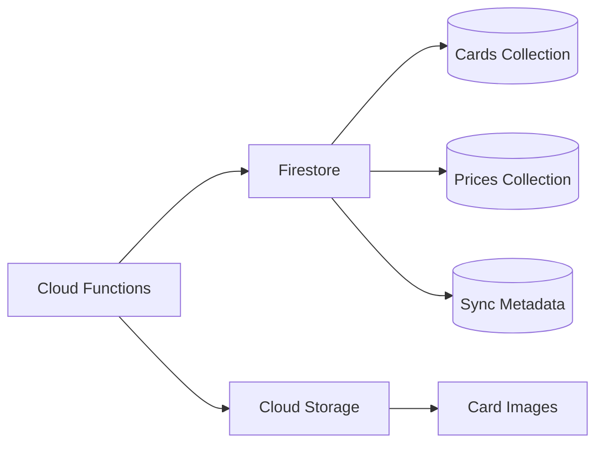

#### Database Collections

- `cards` - Card information and metadata
- `prices` - Current and historical price data
- `syncMetadata` - Sync operation logs and status
- `logs` - System logs and operations history
- `cardHashes` - Change detection hashes
- `priceHashes` - Price update tracking
- `imageMetadata` - Image processing metadata

### Processing Pipeline

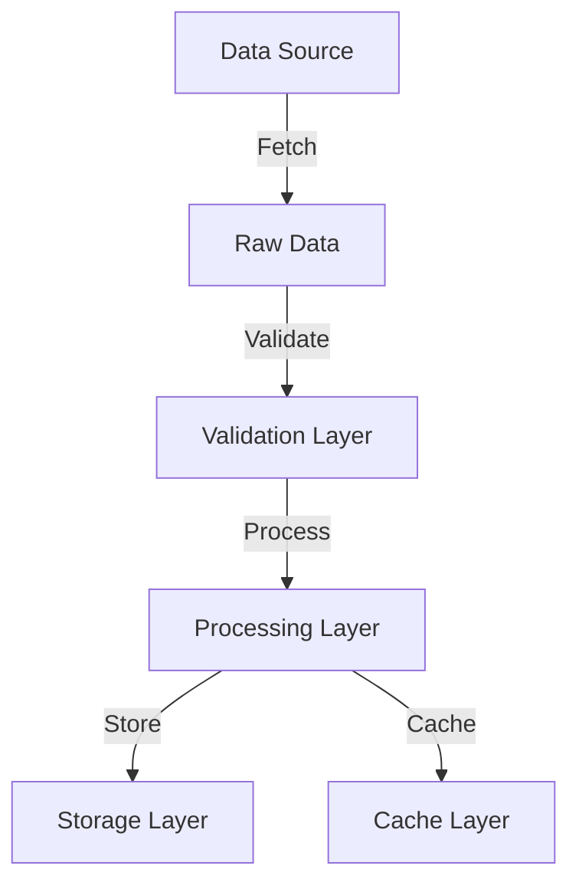

#### Pipeline Components

- Data Fetching
- Validation & Sanitization
- Processing & Transformation
- Storage Management
- Cache Management

## Service Integration

### External Services

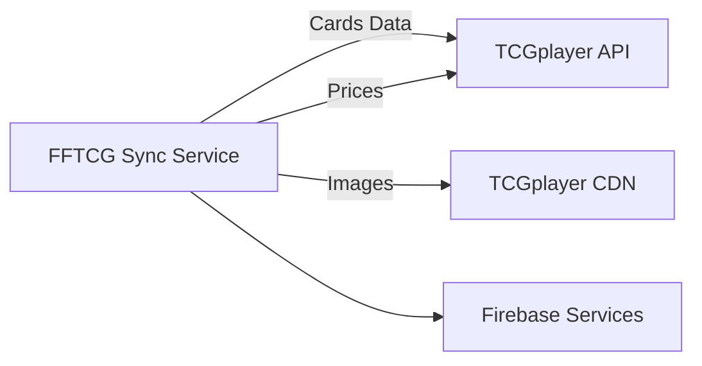

### Internal Services Communication

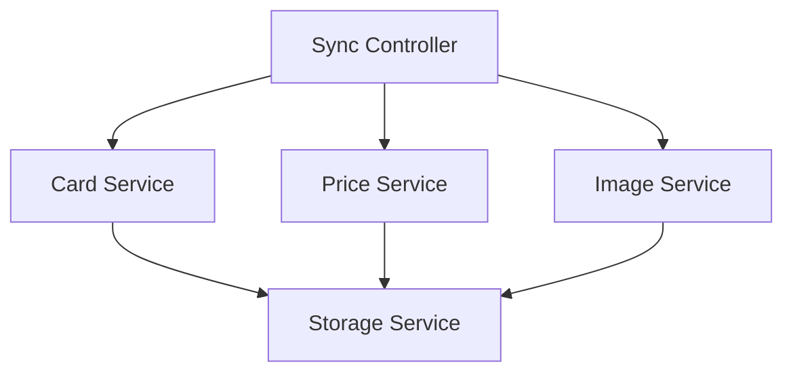

## Data Flow

### Synchronization Flow

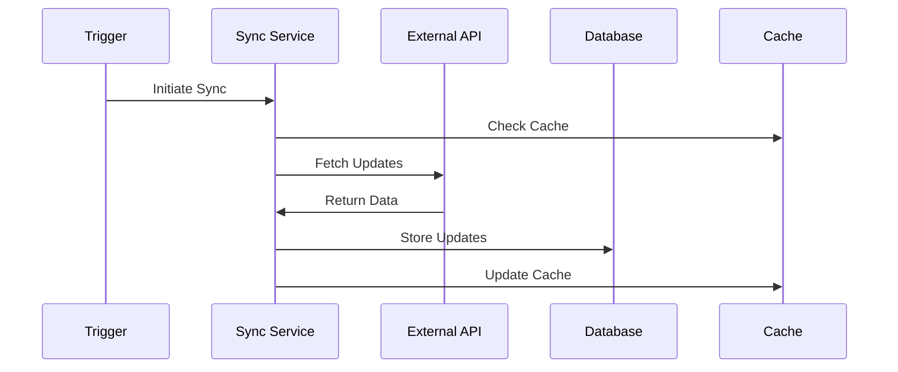

## Error Handling

### Recovery System

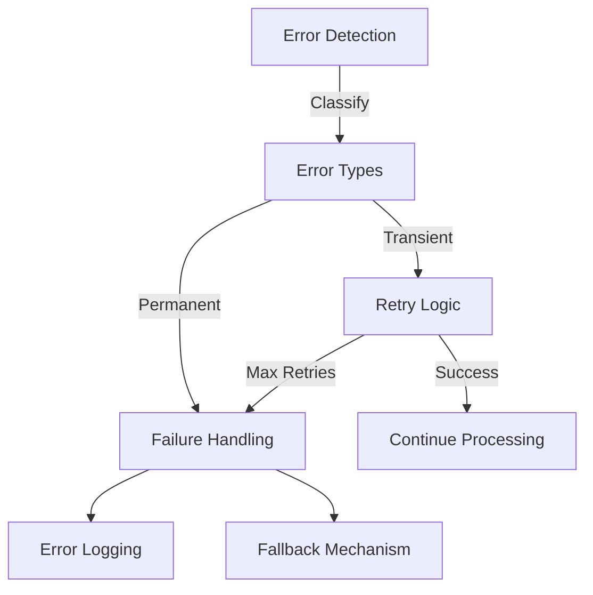

## Performance Optimization

### Caching Strategy

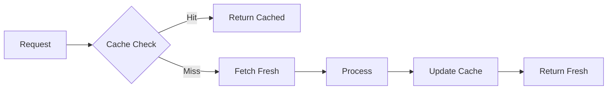

## Security Architecture

### Access Control

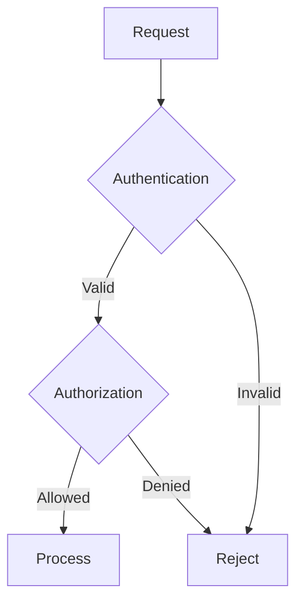

## Monitoring System

### Observability

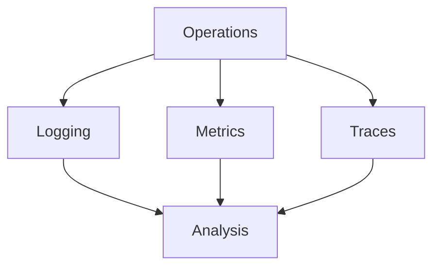

## Resource Management

### Scaling Strategy

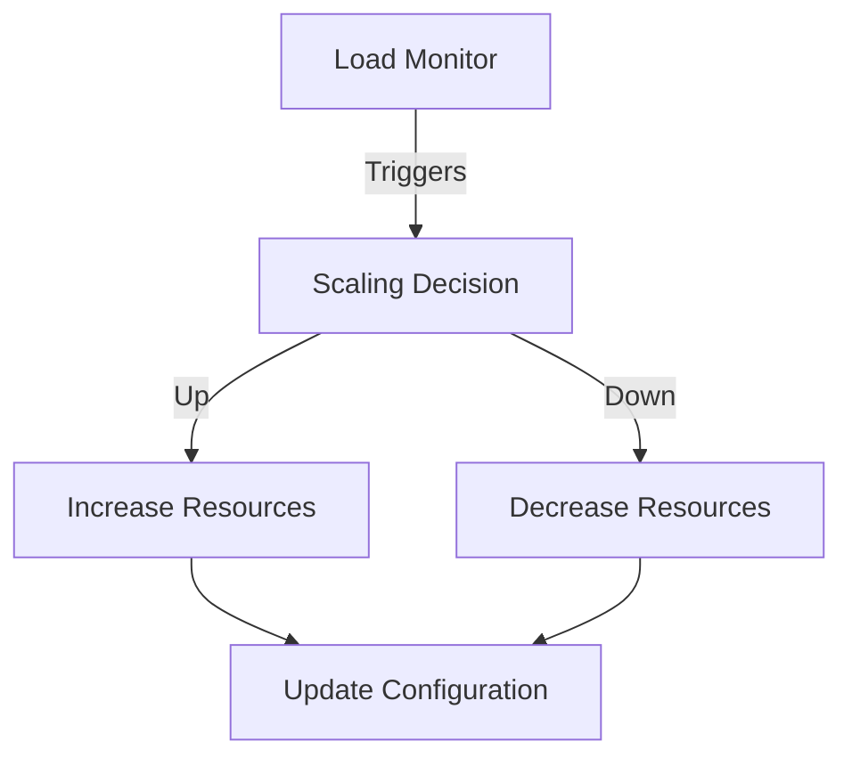

## Configuration Management

### Environment Setup

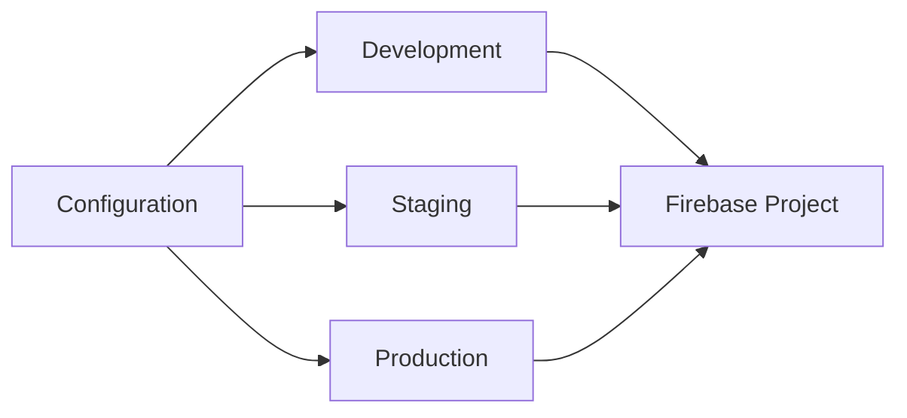

## Best Practices

### Development Workflow

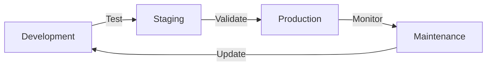

## System Requirements

### Infrastructure

- Node.js 18+
- Firebase Admin SDK
- Cloud Functions
- Firestore
- Cloud Storage
- Memory: 1GB minimum
- Timeout: 540s maximum

### Dependencies

- Firebase Functions
- Firebase Admin
- Axios for HTTP requests
- Sharp for image processing
- LRU Cache for caching
- TypeScript for development

## Deployment Architecture

### CI/CD Pipeline

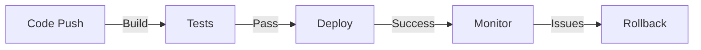

## Additional Resources

- [Installation Guide](/setup/installation)
- [Configuration Guide](/setup/configuration)
- [API Documentation](/api/)
- [Troubleshooting Guide](/troubleshooting)
