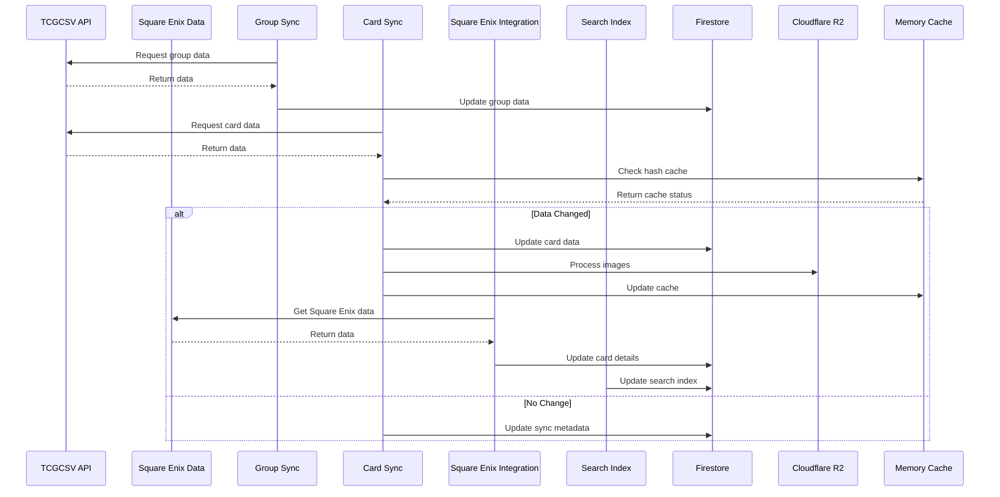
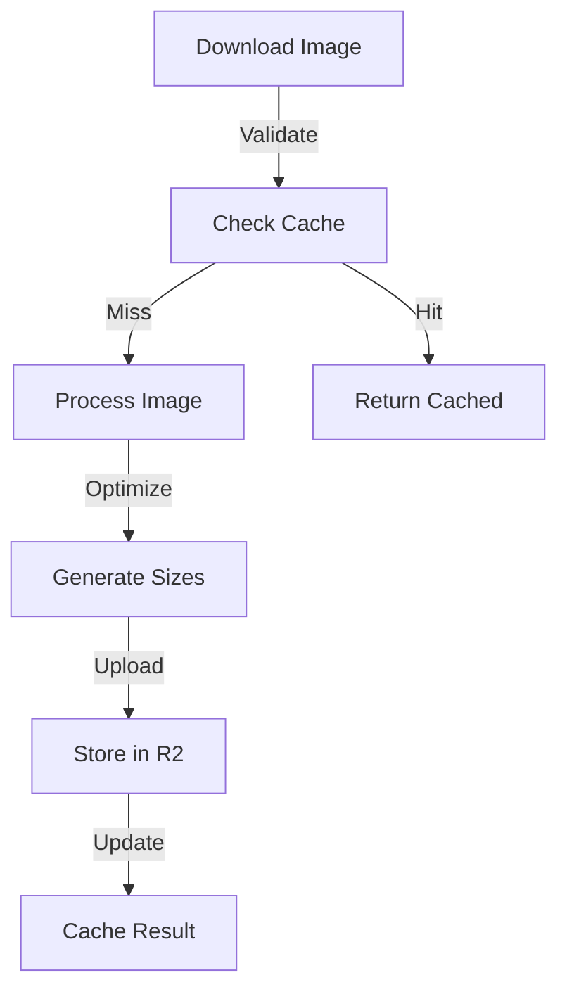

# System Architecture

## Overview

FFTCG Sync Service is a Firebase-based application designed to synchronize Final Fantasy Trading Card Game data. The system uses Firebase Cloud Functions for serverless operations, Firestore for data storage, and Cloudflare R2 for image storage. The architecture emphasizes data accuracy, performance, and maintainability. For setup details, see our [Installation Guide](/setup/installation).

## System Diagram

The diagram below illustrates the key components and their interactions. Each color represents a different component type:

<ArchitectureDiagram :zoom="1.2" :showLabels="true" />

::: tip Component Types

- Blue: Firebase Services (Functions, Firestore)
- Green: Storage Systems (Cloudflare R2, Cache)
- Orange: Core Services (Group Sync, Card Sync, Square Enix Integration, Search Index)
- Gray: External Services (TCGCSV API, Square Enix Data)
:::

## Core Components

### Firebase Services

For detailed configuration, see [Firebase Configuration Guide](/setup/firebase-config).

#### Cloud Functions

```typescript
// Runtime Configuration
export const runtimeOpts = {
  timeoutSeconds: 540,
  memory: "1GiB",
} as const;

// Scheduled Functions
export const scheduledGroupSync = onSchedule({
  schedule: "0 21 * * *",  // Daily at 21:00 UTC
  timeZone: "UTC",
  memory: runtimeOpts.memory,
  timeoutSeconds: runtimeOpts.timeoutSeconds,
  retryCount: 3,
});

export const scheduledCardSync = onSchedule({
  schedule: "15 21 * * *",  // Daily at 21:15 UTC
  timeZone: "UTC",
  memory: runtimeOpts.memory,
  timeoutSeconds: runtimeOpts.timeoutSeconds,
  retryCount: 3,
});

export const scheduledSquareEnixSync = onSchedule({
  schedule: "30 21 * * *", // Daily at 21:30 UTC
  timeZone: "UTC",
  memory: runtimeOpts.memory,
  timeoutSeconds: runtimeOpts.timeoutSeconds,
  retryCount: 3,
});
```

#### Firestore Collections

For collection usage details, see [API Documentation](/api/).

```typescript
export const COLLECTION = {
  GROUPS: "groups",         // Group information
  CARDS: "cards",          // Card information
  CARD_HASHES: "cardHashes",  // Card data version control
  CARD_DELTAS: "cardDeltas",  // Card change tracking
  SYNC_METADATA: "syncMetadata",  // Sync operation logs
  SEARCH_INDEX: "searchIndex",  // Search terms and data
  LOGS: "logs",           // System logs
  IMAGE_METADATA: "imageMetadata",  // Image processing metadata
};
```

#### Storage Configuration

For storage implementation details, see [Image Handler](/utils/image-handler).

```typescript
export const STORAGE = {
  R2_CONFIG: {
    endpoint: process.env.R2_ENDPOINT,
    accessKeyId: process.env.R2_ACCESS_KEY_ID,
    secretAccessKey: process.env.R2_SECRET_ACCESS_KEY,
    bucketName: process.env.R2_BUCKET_NAME,
  },
  PATHS: {
    IMAGES: "card-images",
  },
};
```

### Core Services

#### Group Sync Service

For detailed implementation, see [Group Sync Service](/services/group-sync).

- First step in sync process
- Group data synchronization
- Set name management
- Data consistency checks
- Hash-based change detection

#### Card Sync Service

For detailed implementation, see [Card Sync Service](/services/card-sync).

- Enhanced name processing
- Category handling
- Multi-number card support
- Crystal card handling
- Image processing and optimization
- Hash-based change detection
- Batch processing

#### Square Enix Integration

For detailed implementation, see [Square Enix Integration](/services/square-enix-sync).

- Cost/power value synchronization
- Category handling improvements
- Data enrichment
- Set matching logic
- Duplicate prevention

#### Search Index Service

For detailed implementation, see [Search Index Service](/services/search-index).

- Progressive substring search
- Number-specific search terms
- Real-time index updates
- Batch processing optimization
- Hash-based change detection

### Utility Systems

#### Caching System

For implementation details, see [Cache System](/utils/cache).

```typescript
const cacheOptions = {
  groupCache: {
    max: 100,
    ttl: 1000 * 60 * 60  // 1 hour
  },
  cardCache: {
    max: 500,
    ttl: 1000 * 60 * 60  // 1 hour
  },
  searchCache: {
    max: 1000,
    ttl: 1000 * 60 * 5  // 5 minutes
  },
  imageCache: {
    metadata: {
      max: 1000,
      ttl: 1000 * 60 * 60  // 1 hour
    },
    buffer: {
      max: 100,
      ttl: 1000 * 60 * 5,  // 5 minutes
      maxSize: 50 * 1024 * 1024  // 50MB
    }
  }
};
```

#### Batch Processing

For implementation details, see [Batch Processing](/utils/batch).

```typescript
interface BatchOptions {
  batchSize?: number;  // Default: 500
  delayBetweenBatches?: number;  // Default: 100ms
  onBatchComplete?: (stats: BatchProcessingStats) => Promise<void>;
  maxConcurrent?: number;  // Default: 3
}
```

#### Error Handling

For detailed implementation, see [Error Handling](/utils/error-handling).

```typescript
interface ErrorReport {
  timestamp: Date;
  context: string;
  error: string;
  stackTrace?: string;
  metadata?: Record<string, unknown>;
  severity: "ERROR" | "WARNING" | "CRITICAL";
  component?: string;
  operation?: string;
}
```

## Data Flow

### Synchronization Process



### Image Processing Pipeline



## Performance Optimization

For detailed performance guidelines, see [Performance Guide](/performance).

### Resource Management

- Memory allocation: 1GB per function
- Function timeout: 540 seconds
- Batch size: 500 items
- Cache TTL: Configurable per type
- Concurrent operations: 3-5 per type

### Rate Limiting

For rate limiting implementation, see [Request Handler](/utils/request).

```typescript
const rateLimits = {
  tcgcsv: {
    requestsPerMinute: 100,
    concurrentRequests: 10
  },
  squareEnix: {
    requestsPerMinute: 50,
    concurrentRequests: 5
  },
  storage: {
    uploadsPerMinute: 50,
    maxConcurrent: 5
  }
};
```

## Security

For detailed security implementation, see [Security Guidelines](/security).

### Authentication

- Firebase Authentication
- Service account credentials
- R2 access credentials
- Token-based API access

### Data Protection

```typescript
// Firestore Rules
rules_version = '2';
service cloud.firestore {
  match /databases/{database}/documents {
    match /cards/{cardId} {
      allow read: if true;
      allow write: if request.auth != null 
        && request.auth.token.admin == true;
    }
    match /groups/{groupId} {
      allow read: if true;
      allow write: if request.auth != null 
        && request.auth.token.admin == true;
    }
  }
}
```

## Monitoring

For detailed monitoring setup, see [Monitoring Guide](/monitoring/).

### Health Checks

```typescript
export const healthCheck = onRequest({
  timeoutSeconds: 10,
  memory: "128MiB",
}, async (_req: Request, res: Response) => {
  const status = await checkComponents();
  res.json({
    status: status.healthy ? "healthy" : "unhealthy",
    components: status.components,
    timestamp: new Date().toISOString(),
    version: "1.0.0",
  });
});
```

### Logging System

For logging implementation details, see [Logging System](/utils/logging).

- Structured logging
- Error tracking
- Performance monitoring
- Operation auditing
- Component-specific logging

## Additional Resources

- [Installation Guide](/setup/installation)
- [Configuration Guide](/setup/configuration)
- [API Documentation](/api/)
- [Troubleshooting Guide](/troubleshooting)
