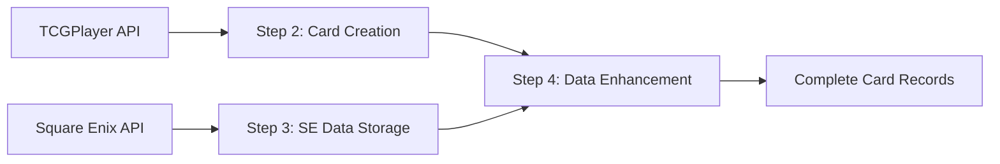

# Card Synchronization Service

## Overview

The Card Synchronization service (`cardSync.ts`) manages the initial
synchronization of FFTCG card data from TCGPlayer's API. This service creates
the foundational card records that are later enhanced with authoritative Square
Enix data. It handles card information creation, image processing, and maintains
data consistency through hash-based versioning, with special handling for
various card types and formats.

**Note**: This service is Step 2 of the complete 4-step sync process. See
[Complete Sync Process](#complete-sync-process) below.

## Core Features

- Automated card data synchronization from multiple sources
- Enhanced name processing and preservation
- Advanced category handling with DFF prioritization
- Crystal card special handling
- Multi-number card support
- Group-based set name handling
- Cost/power value synchronization
- Image processing and storage with placeholder fallback
- Batch processing with optimization
- Comprehensive error handling and retry logic
- Hash-based change detection
- Progress tracking and logging

## API Reference

### Main Function

```typescript
async function syncCards(options: SyncOptions = {}): Promise<SyncResult>
```

#### Options

```typescript
interface SyncOptions {
  dryRun?: boolean;      // Run without making changes
  limit?: number;        // Limit number of cards processed
  groupId?: string;      // Process specific group only
  skipImages?: boolean;  // Skip image processing
  forceUpdate?: boolean; // Force update regardless of hash
}
```

#### Response

```typescript
interface SyncResult {
  success: boolean;
  itemsProcessed: number;
  itemsUpdated: number;
  errors: string[];
  timing: {
    startTime: Date;
    groupStartTime?: Date;
    endTime?: Date;
    duration?: number;
  };
}
```

## Data Processing Features

### Name Processing

- Special content preservation in parentheses
- Crystal card handling
- Date preservation in names
- Card number removal from display names
- Special keyword handling (EX, LB, etc.)
- Proper handling of promo cards

### Category Handling

- DFF category prioritization
- Middot separator implementation
- Array ordering preservation
- Format consistency
- Raw category preservation
- Duplicate category prevention
- Consistent character encoding
- Specific category formatting rules:
  - "Theatrhythm", "Mobius", "Pictlogica", and "Type-0" always in that exact
    format
  - "World of Final Fantasy" always converted to "WOFF"
  - "Lord of Vermilion" always converted to "LOV"
  - Roman numerals (I, II, III, etc.) always in uppercase
  - Known acronyms (DFF, FF, FFCC, etc.) preserved in uppercase
  - Other categories in title case (first letter of each word capitalized)

### Card Number Processing

- Multi-number card support
- Standardized separator usage
- Format validation
- Promo card special handling
- Proper null handling for non-card products
- Intelligent detection of card products vs. non-card products
- Support for various number formats:
  - PR-### (Promo cards)
  - #-###X or ##-###X (Standard cards)
  - A-### (Special cards)
  - C-### (Crystal cards)
  - B-### (Bonus cards)
  - Re-###X (Reprint cards)
- Reprint card handling:
  - Preservation of "Re-" prefix numbers during Square Enix data updates
  - Inclusion in search terms for improved searchability
  - Proper hash calculation to detect changes

## Complete Sync Process

The card synchronization is part of a **4-step process** coordinated by the
`scheduledCardSync` function:

### Step 1: Group Sync

```typescript
await groupSync.syncGroups();
```

- Syncs set/group information from TCGPlayer API
- Ensures group metadata is available for card processing

### Step 2: TCGPlayer Card Sync (This Service)

```typescript
await cardSync.syncCards();
```

- **Primary Role**: Creates initial card records with TCGPlayer data
- **Description Source**: TCGPlayer API (often incomplete/truncated)
- **Data Quality**: Good for basic info, incomplete for descriptions
- **Output**: Base card records ready for enhancement

### Step 3: Square Enix Data Sync

```typescript
await squareEnixStorage.syncSquareEnixCards();
```

- Fetches and stores complete Square Enix card data
- Processes official card information including complete descriptions
- Stores data in separate collection for later application

### Step 4: Square Enix Enhancement

```typescript
await updateCardsWithSquareEnixData();
```

- **Critical Step**: Applies complete Square Enix data to TCGPlayer cards
- **Description Priority**: Square Enix descriptions overwrite TCGPlayer
  descriptions
- **Result**: Cards now have complete, accurate descriptions and data

### Data Flow Summary



### Group Integration

- Group sync as first step
- Set name handling from groups
- Proper group ID handling
- Data consistency checks
- Improved set matching logic

### Cost/Power Synchronization

- Value validation
- Conditional updates
- Null value handling
- Set matching improvements
- Multiple set handling

### Square Enix Data Integration

- Automatic population of missing fields from Square Enix data
- Intelligent detection and correction of cards incorrectly marked as non-cards
- Field synchronization for:
  - Card type (Forward, Backup, Summon, etc.)
  - Elements (Fire, Ice, Wind, etc.)
  - Categories (FF game identifiers)
  - Cost and power values
- Preservation of special card names and formats
- Hash-based change detection to minimize unnecessary updates
- Multiple set handling

## Usage Examples

### Standard Sync

```typescript
// Full sync with all features
await cardSync.syncCards();

// Sync specific group
await cardSync.syncCards({
  groupId: "23783"
});

// Test sync with limits
await cardSync.syncCards({
  dryRun: true,
  limit: 5
});
```

### Force Update

```typescript
// Force update regardless of hash
await cardSync.syncCards({
  forceUpdate: true
});
```

## Error Handling

The service implements comprehensive error handling with specific error types:

```typescript
interface CardSyncError {
  code: string;
  message: string;
  details?: {
    cardId?: number;
    groupId?: number;
    operation?: string;
    [key: string]: unknown;
  };
}
```

### Retry Strategy

```typescript
private readonly retry = new RetryWithBackoff({
  maxRetries: 3,
  baseDelay: 1000,
  maxDelay: 10000
});
```

## Data Consistency

### Hash-based Change Detection

```typescript
private calculateHash(card: CardProduct): string {
  const deltaData = this.getDeltaData(card);
  return crypto.createHash("md5")
    .update(JSON.stringify(deltaData))
    .digest("hex");
}
```

### Batch Processing

```typescript
private readonly batchProcessor = new OptimizedBatchProcessor(db);

// Add operations to batch
await this.batchProcessor.addOperation((batch) => {
  batch.set(docRef, data, { merge: true });
});

// Commit all batches
await this.batchProcessor.commitAll();
```

## Monitoring

### Progress Tracking

The service provides detailed progress information:

- Cards processed and updated
- Groups processed
- Hash changes detected
- Processing duration
- Error counts and types
- Image processing status

### Performance Metrics

- Batch processing efficiency
- Memory usage
- API call frequency
- Cache hit rates
- Error rates by type

## Best Practices

1. Testing Changes:
    - Use dry run mode first
    - Test with limited card sets
    - Verify hash calculations
    - Check category handling

2. Performance Optimization:
    - Use batch processing
    - Implement proper caching
    - Monitor memory usage
    - Optimize database queries

3. Error Handling:
    - Implement proper retry logic
    - Log detailed error information
    - Monitor error patterns
    - Handle edge cases

## Troubleshooting

### Common Issues

1. Data Synchronization:
    - Verify API responses
    - Check hash calculations
    - Monitor batch processing
    - Validate category handling

2. Image Processing:
    - Verify storage permissions
    - Check image URLs
    - Monitor storage quotas
    - Validate image metadata
    - Ensure placeholder images are used for invalid or missing images

#### Placeholder Image Handling

The Card Sync Service integrates with the Storage Service to ensure that cards
without valid images always use a placeholder image:

```typescript
// Process image handling
const imageResult = await (async () => {
  const PLACEHOLDER_URL = "https://fftcgcompanion.com/card-images/image-coming-soon.jpeg";
  if (card.imageUrl) {
    // If URL exists, process normally
    return await this.retry.execute(() =>
      storageService.processAndStoreImage(card.imageUrl, card.productId, groupId.toString())
    );
  } else {
    // For any item without image, use placeholder URL
    return {
      fullResUrl: PLACEHOLDER_URL,
      highResUrl: PLACEHOLDER_URL,
      lowResUrl: PLACEHOLDER_URL,
      metadata: {},
    } as ImageResult;
  }
})();
```

This ensures that cards always have valid image URLs for all three resolutions
(low, high, and full), preventing null values in the database. See the
[Storage Service](./storage-service) documentation for more details on image
processing and placeholder handling.

1. Performance:
    - Monitor batch sizes
    - Check memory usage
    - Optimize database queries
    - Review cache efficiency

## Related Components

- [Group Sync Service](./group-sync)
- [Square Enix Integration](./square-enix-sync)
- [Search Index Service](./search-index)
- [Storage Service](./storage-service)
- [Image Handler](../utils/image-handler)
- [Cache System](../utils/cache)
- [Error Handling](../utils/error-handling)
